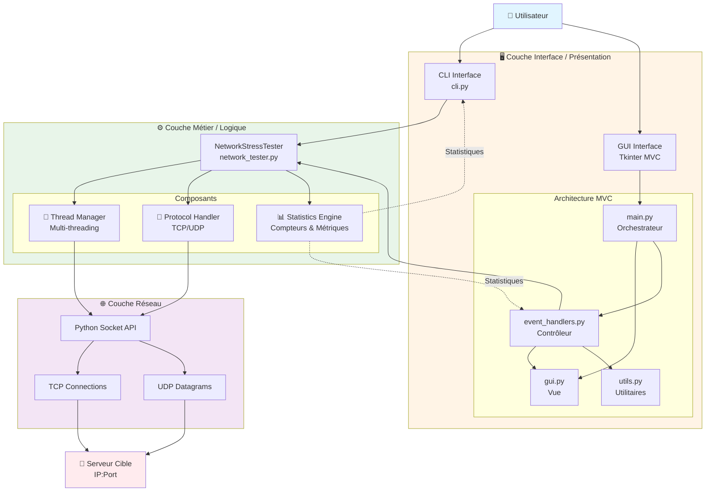
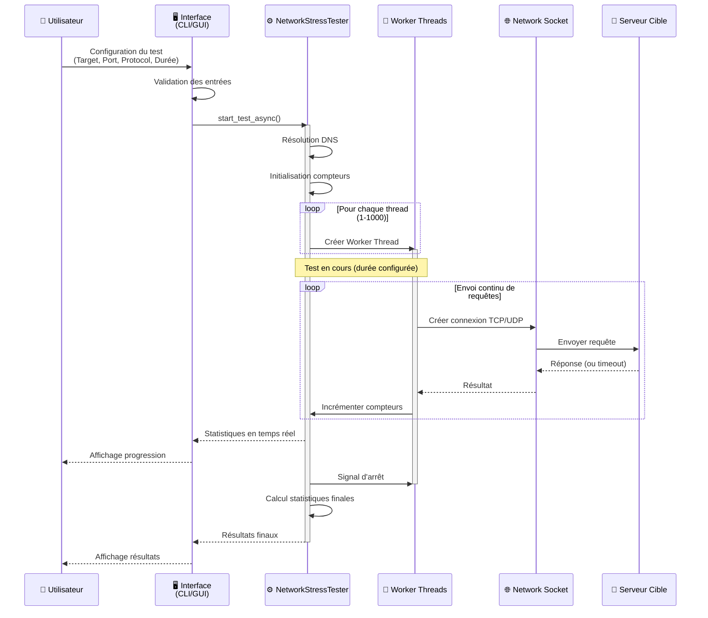
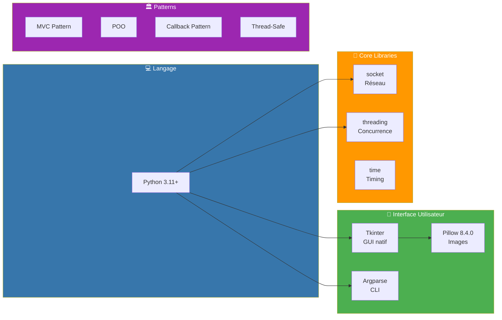
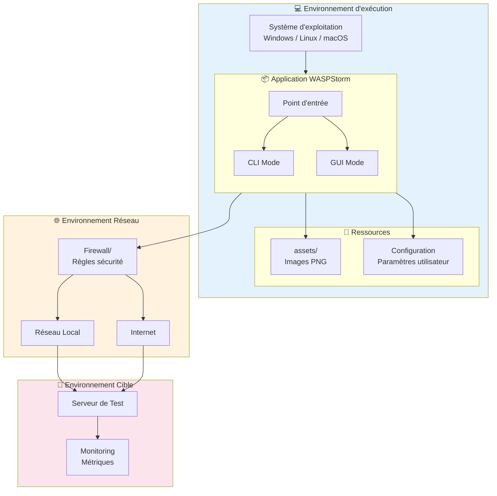
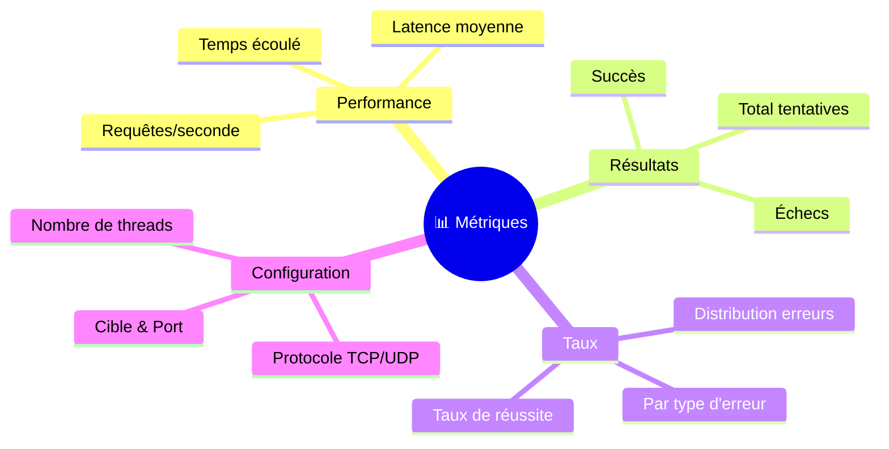

# 🏗️ WASPStorm - Architecture & Environment

## 📊 Diagramme d'Architecture Système

## 🔄 Flux de Données

## 🛠️ Stack Technique

## 🌍 Environnement d'Exécution

## 📋 Composants Principaux

| Composant | Responsabilité | Technologie |
|-----------|---------------|-------------|
| **CLI Interface** | Interface ligne de commande | Python Argparse |
| **GUI Interface** | Interface graphique utilisateur | Tkinter + MVC |
| **NetworkStressTester** | Logique métier du test | Python OOP + Threading |
| **Worker Threads** | Envoi parallèle de requêtes | threading.Thread |
| **Protocol Handler** | Gestion TCP/UDP | socket library |
| **Statistics Engine** | Calcul des métriques | Thread-safe counters |

## 🔐 Caractéristiques Techniques

- **Thread-Safe**: Utilisation de Lock pour sécuriser les compteurs partagés
- **Asynchrone**: Tests non-bloquants avec callbacks
- **Scalable**: Support de 1 à 1000 threads simultanés
- **Protocoles**: TCP et UDP
- **Monitoring**: Statistiques en temps réel
- **Robuste**: Gestion d'erreurs et timeout configurables

## 📊 Métriques Collectées

## 🎯 Cas d'Usage

1. **Test de Charge** - Évaluer la capacité maximale du serveur
2. **Test de Stress** - Identifier les points de rupture
3. **Test de Résilience** - Vérifier la récupération après charge
4. **Audit de Sécurité** - Valider les protections anti-DDoS

---

*Ce diagramme représente l'architecture complète de WASPStorm pour une présentation professionnelle*

